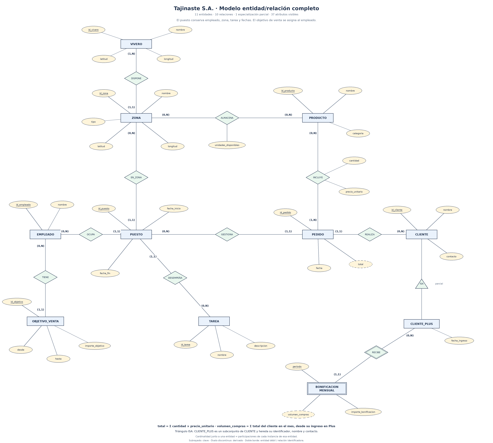

# Práctica 3. Modelo entidad/relación: Viveros

**Asignatura:** Administración y diseño de bases de datos · Grado en Ingeniería Informática · Universidad de La Laguna.

**Autor:** Iván Hernández.

Se propone un modelo conceptual para Tajinaste S.A. que permite consultar las existencias de cada producto en cada zona, conservar el historial de puestos de los empleados y registrar los pedidos de los clientes Tajinaste Plus. Los pedidos se atribuyen al puesto desde el que se gestionaron: por ese camino se obtiene un único empleado responsable y la zona histórica. Los objetivos de venta permiten comparar el volumen gestionado con una meta cuantificada.

## Archivos del modelo

- [Modelo editable en Draw.io](modelo/modelo_viveros.drawio): cuatro páginas del mismo modelo, con una vista general y tres vistas de detalle.
- [Vista general en PNG](modelo/modelo_viveros.png).
- [Viveros y existencias](modelo/viveros_stock.png).
- [Historial de puestos y objetivos](modelo/historial_productividad.png).
- [Pedidos y fidelización](modelo/pedidos_fidelizacion.png).

Para editar, abrir `modelo/modelo_viveros.drawio` desde **Archivo → Abrir desde → Dispositivo** en Draw.io. Las formas, los atributos y las conexiones son editables; las páginas de detalle amplían las entidades de la vista general, no crean entidades adicionales.

## Notación y alcance

Se utiliza la notación entidad/relación de Chen: rectángulos para entidades, rombos para relaciones y óvalos para atributos. Una clave aparece subrayada; un atributo derivado tiene el óvalo discontinuo. La bonificación mensual es una entidad débil: se representa con doble rectángulo, su relación identificadora con doble rombo y su clave parcial con subrayado discontinuo.

La pareja `(mínimo,máximo)` situada junto a una entidad indica cuántas veces puede participar **cada instancia de esa entidad** en la relación. Por ejemplo, en `REALIZA`, `(0,N)` junto a `CLIENTE_PLUS` indica que un cliente puede realizar cero o muchos pedidos, mientras que `(1,1)` junto a `PEDIDO` significa que cada pedido pertenece exactamente a un cliente.

El alcance comercial son los pedidos de clientes Tajinaste Plus desde su ingreso. Las cifras de ventas y los objetivos descritos aquí corresponden a ese ámbito. No se presupone un porcentaje de bonificación: el enunciado no proporciona la política de cálculo. Las cantidades se expresan en unidades de producto y los importes en euros.

## 1. Entidades y atributos

Los identificadores son códigos únicos, obligatorios y estables. Los ejemplos son ficticios. Todos los atributos almacenados son obligatorios salvo las excepciones indicadas. Las coordenadas se expresan en grados decimales del sistema WGS 84 y son independientes para viveros y zonas.

### VIVERO

Establecimiento de la red de Tajinaste S.A. Cada vivero tiene su propia ubicación y al menos una zona.

| Atributo | Dominio y significado | Ejemplo |
| --- | --- | --- |
| **id_vivero** — clave | Código de texto no vacío, único en toda la empresa. | `V01` |
| nombre | Texto no vacío con el nombre del establecimiento. | `Vivero Norte` |
| latitud | Número decimal entre −90 y 90. | `28.480000` |
| longitud | Número decimal entre −180 y 180. | `-16.320000` |

### ZONA

Área concreta de un vivero. Su identificador es global: no depende de que dos viveros utilicen el mismo nombre para sus zonas.

| Atributo | Dominio y significado | Ejemplo |
| --- | --- | --- |
| **id_zona** — clave | Código de texto no vacío, único en toda la empresa. | `Z01` |
| nombre | Texto no vacío. Puede repetirse en distintos viveros. | `Exterior A` |
| tipo | Texto no vacío que clasifica la zona; los ejemplos no forman una lista cerrada. | `exterior`, `almacén`, `invernadero` |
| latitud | Número decimal entre −90 y 90, correspondiente a la zona. | `28.480100` |
| longitud | Número decimal entre −180 y 180, correspondiente a la zona. | `-16.319900` |

### PRODUCTO

Referencia del catálogo. La referencia puede estar asignada a varias zonas y viveros.

| Atributo | Dominio y significado | Ejemplo |
| --- | --- | --- |
| **id_producto** — clave | Código de texto no vacío, único por referencia. | `PR01` |
| nombre | Texto no vacío con el nombre comercial. | `Monstera en maceta` |
| categoria | Uno de los valores `planta`, `jardinería` o `decoración`. | `planta` |

El precio cobrado se registra en cada relación `INCLUYE`; así un cambio de precio posterior no modifica el importe de un pedido anterior.

### EMPLEADO

Persona de la plantilla. Su ubicación y su tarea se consultan mediante los puestos históricos.

| Atributo | Dominio y significado | Ejemplo |
| --- | --- | --- |
| **id_empleado** — clave | Código de texto no vacío, único por empleado. | `E01` |
| nombre | Texto no vacío con el nombre de la persona. | `Ana Pérez` |

### TAREA

Tipo de actividad que realiza un empleado en una zona. Es una entidad porque una misma tarea puede asignarse a muchos puestos y describirse una sola vez.

| Atributo | Dominio y significado | Ejemplo |
| --- | --- | --- |
| **id_tarea** — clave | Código de texto no vacío, único por tarea. | `T01` |
| nombre | Texto no vacío. | `Venta y gestión de pedidos` |
| descripcion | Texto que explica la actividad. | `Atención al cliente y tramitación de pedidos` |

### PUESTO

Asignación histórica de **un empleado a una zona y una tarea durante un intervalo**. Un cambio de empleado, zona o tarea origina un nuevo registro; los anteriores se conservan.

| Atributo | Dominio y significado | Ejemplo |
| --- | --- | --- |
| **id_puesto** — clave | Código de texto no vacío, único por asignación histórica. | `PU01` |
| fecha_inicio | Fecha y hora de inicio, incluida en el intervalo. | `2026-10-01 09:00` |
| fecha_fin | Fecha y hora de finalización, excluida del intervalo. Puede estar vacía si el puesto sigue abierto. | `2026-11-01 09:00` |

Las asociaciones con `EMPLEADO`, `ZONA` y `TAREA` se representan como relaciones, no como atributos de clave foránea: este es un modelo conceptual. El vivero de un puesto se obtiene mediante su zona, por lo que no se almacena una segunda asociación que pudiera contradecirla.

### CLIENTE_PLUS

Cliente que pertenece al programa Tajinaste Plus. No se crea una entidad para el programa porque el escenario solo describe uno.

| Atributo | Dominio y significado | Ejemplo |
| --- | --- | --- |
| **id_cliente** — clave | Código de texto no vacío, único por cliente. | `C01` |
| nombre | Texto no vacío con el nombre del cliente. | `Luis Martín` |
| contacto | Texto con un medio de contacto. Puede estar vacío si no se ha facilitado. | `cliente01@example.org` |
| fecha_ingreso | Fecha y hora desde la que pertenece al programa. | `2026-09-15 12:00` |

### PEDIDO

Compra de un cliente Plus, con uno o varios productos y un único puesto encargado de gestionarla. Cada puesto tiene exactamente un empleado, de modo que también hay un único responsable del pedido.

| Atributo | Dominio y significado | Ejemplo |
| --- | --- | --- |
| **id_pedido** — clave | Código de texto no vacío, único por pedido. | `PD01` |
| fecha | Fecha y hora de la compra, que determina su mes y el puesto vigente. | `2026-10-08 10:30` |
| total — derivado | Importe decimal no negativo, en euros: suma de `cantidad × precio_unitario` de todas las líneas. No es un dato independiente. | `56.00` |

No se guarda un segundo empleado responsable dentro de `PEDIDO`: se obtiene mediante `PEDIDO → PUESTO → EMPLEADO`. La asociación al puesto también conserva la zona histórica, aunque después el empleado cambie de destino.

### OBJETIVO_VENTA

Meta monetaria para un puesto durante un intervalo. Esta entidad concreta la referencia del enunciado a alcanzar objetivos de venta y permite comparar la meta con los pedidos gestionados en ese periodo.

| Atributo | Dominio y significado | Ejemplo |
| --- | --- | --- |
| **id_objetivo** — clave | Código de texto no vacío, único por objetivo. | `OV01` |
| desde | Fecha y hora de inicio del periodo, incluida. | `2026-10-01 09:00` |
| hasta | Fecha y hora de finalización del periodo, excluida. | `2026-11-01 09:00` |
| importe_objetivo | Importe decimal estrictamente positivo, en euros. | `2000.00` |

### BONIFICACION_MENSUAL

Bonificación concedida a un cliente en un mes. Es una entidad débil dependiente de `CLIENTE_PLUS`: se identifica por **cliente + periodo**. Dos clientes pueden tener una bonificación para el mismo mes, pero un cliente no puede tener dos bonificaciones distintas para ese mes.

| Atributo | Dominio y significado | Ejemplo |
| --- | --- | --- |
| **periodo** — clave parcial | Mes natural válido, expresado como `AAAA-MM`. Solo es único dentro de cada cliente. | `2026-10` |
| importe_bonificacion | Importe decimal no negativo concedido, en euros. | `5.00` |
| volumen_compras — derivado | Importe decimal no negativo: suma de los totales de los pedidos del cliente en ese mes. | `150.00` |

El importe de la bonificación se conserva como resultado concedido. Su validación depende de la política comercial vigente, que no está definida en el enunciado. No se deduce automáticamente que sea el 5 %, el 10 % ni otro porcentaje.

## 2. Relaciones y cardinalidades

Las cardinalidades se expresan **por instancia de la entidad nombrada en cada columna**. En las relaciones con puestos y pedidos, los mínimos permiten registrar empleados, productos o clientes que todavía no tienen actividad.

| Relación | Primera entidad: participaciones | Segunda entidad: participaciones | Descripción |
| --- | --- | --- | --- |
| DISPONE | VIVERO `(1,N)` | ZONA `(1,1)` | Un vivero tiene una o varias zonas; cada zona pertenece a un único vivero. |
| ALMACENA | ZONA `(0,N)` | PRODUCTO `(0,N)` | Una zona puede tener muchas referencias y una referencia puede asignarse a muchas zonas. Cada pareja conserva sus unidades disponibles. |
| OCUPA | EMPLEADO `(0,N)` | PUESTO `(1,1)` | Un empleado acumula puestos históricos; cada puesto corresponde a un único empleado. |
| EN_ZONA | PUESTO `(1,1)` | ZONA `(0,N)` | Cada puesto se desarrolla en una zona; una zona puede recibir muchos puestos a lo largo del tiempo. |
| DESEMPEÑA | PUESTO `(1,1)` | TAREA `(0,N)` | Cada puesto tiene una tarea; la misma tarea puede aparecer en muchos puestos. |
| TIENE | PUESTO `(0,N)` | OBJETIVO_VENTA `(1,1)` | Un puesto puede tener varios objetivos en distintos periodos; cada objetivo corresponde a un único puesto. |
| GESTIONA | PUESTO `(0,N)` | PEDIDO `(1,1)` | Un puesto puede gestionar muchos pedidos; cada pedido tiene exactamente un puesto gestor y, por tanto, un empleado responsable. |
| REALIZA | CLIENTE_PLUS `(0,N)` | PEDIDO `(1,1)` | Un cliente puede realizar muchos pedidos; cada pedido corresponde a un único cliente. |
| INCLUYE | PEDIDO `(1,N)` | PRODUCTO `(0,N)` | Todo pedido contiene al menos un producto; un producto puede aparecer en muchos pedidos. |
| RECIBE — identificadora | CLIENTE_PLUS `(0,N)` | BONIFICACION_MENSUAL `(1,1)` | Un cliente recibe bonificaciones mensuales; cada bonificación depende de un único cliente y se identifica dentro de él por su periodo. |

### Atributos de las relaciones

| Relación | Atributo | Dominio | Ejemplo y significado |
| --- | --- | --- | --- |
| ALMACENA | unidades_disponibles | Entero mayor o igual que cero. | `12`: hay doce unidades de `PR01` en `Z01`. `0` significa que sigue asignado, pero no quedan existencias. |
| INCLUYE | cantidad | Entero estrictamente positivo. | `2`: el pedido incluye dos unidades de ese producto. |
| INCLUYE | precio_unitario | Decimal mayor o igual que cero, en euros, con dos decimales. | `18.50`: precio cobrado por unidad en ese pedido. |

Las demás relaciones no tienen atributos propios. Las fechas pertenecen a `PUESTO`, las metas a `OBJETIVO_VENTA` y las bonificaciones a `BONIFICACION_MENSUAL`.

## 3. Restricciones semánticas

Además de las cardinalidades, se aplican las siguientes restricciones:

1. **Pertenencia territorial.** Toda zona pertenece a exactamente un vivero. La zona del puesto determina el vivero en el que trabaja el empleado durante su intervalo.
2. **Existencias por pareja.** Solo existe un registro de `ALMACENA` por pareja `(zona, producto)`. Las unidades disponibles nunca son negativas. La ausencia de la pareja significa que el producto no está asignado a esa zona; una pareja con valor cero sí conserva la asignación.
3. **Intervalos históricos.** Un puesto es válido en `[fecha_inicio, fecha_fin)`. Si existe fecha de fin, debe ser posterior a la de inicio. Una fecha de fin vacía equivale a un extremo final abierto. Se pueden encadenar dos puestos cuando el segundo empieza exactamente al terminar el primero.
4. **Un único vivero a la vez.** Para dos puestos del mismo empleado que pertenecen a viveros distintos, sus intervalos no pueden solaparse. Las cardinalidades por sí solas no expresan esta regla temporal. No se prohíben tareas concurrentes dentro del mismo vivero, porque el enunciado solo prohíbe dos destinos simultáneos; cada tarea se registra mediante su puesto.
5. **Conservación del historial.** Un cambio de zona o tarea produce un nuevo puesto. Los datos de empleado, zona y tarea de un puesto con actividad registrada no se sobrescriben, ni se eliminan puestos referenciados por pedidos u objetivos.
6. **Responsabilidad única y vigente.** Todo pedido se vincula a exactamente un puesto. Su fecha debe estar dentro del intervalo de ese puesto. El empleado de ese puesto es su único responsable, también cuando después cambia de vivero.
7. **Contenido del pedido.** Un pedido contiene al menos una línea. Cada producto aparece como máximo una vez por pedido; si se compran varias unidades, se expresa en `cantidad`. Cantidades e importes cumplen los dominios indicados. El total se deriva de las líneas y no puede modificarse de forma independiente.
8. **Ingreso en Tajinaste Plus.** La fecha de un pedido debe ser igual o posterior a la fecha de ingreso de su cliente. Así el historial del programa empieza en el ingreso y no mezcla compras anteriores.
9. **Bonificación mensual única.** La pareja `(cliente, periodo)` es única. El mes de la bonificación debe ser el mes de ingreso o uno posterior; durante el mes de ingreso solo cuentan compras desde la fecha y hora de alta. Un mes puede todavía no tener bonificación concedida, por eso la participación del cliente es `(0,N)`.
10. **Objetivos comparables.** `desde < hasta`, el importe objetivo es positivo y el intervalo del objetivo queda dentro del intervalo del puesto. Se adopta un único objetivo monetario activo por puesto en cada instante: sus intervalos no se solapan. Esto evita contar dos veces la misma meta al agregar resultados.
11. **Atribución de productividad.** Un pedido se cuenta una sola vez, para el empleado y la zona del puesto gestor. La zona a la que se atribuye la venta es la zona de trabajo del responsable; no se presupone que sea la zona de la que físicamente se retira el producto.

Los mínimos elegidos incluyen dos supuestos explícitos: todo vivero registrado dispone de al menos una zona y todo pedido registrado está completo, con al menos una línea. `OBJETIVO_VENTA` y la atribución histórica a zona concretan cómo se medirá la productividad. Las bonificaciones se conservan por meses, sin inventar la política comercial.

## 4. Información que permite obtener el modelo

| Consulta necesaria | Datos utilizados |
| --- | --- |
| Existencias de un producto en una zona | `ALMACENA.unidades_disponibles`. |
| Existencias de un producto en un vivero | Suma de las existencias de todas las zonas de ese vivero. |
| Localización de un vivero o una zona | Atributos de latitud y longitud de la entidad correspondiente. |
| Dónde trabajaba un empleado en una fecha | Puestos del empleado cuyo intervalo contenga la fecha → zona → vivero. |
| Qué tarea realizaba en esa zona | Tarea asociada a cada puesto vigente. |
| Historial de compras desde el ingreso | Pedidos de `CLIENTE_PLUS`, ordenados por fecha. |
| Volumen mensual de compras | Suma de los totales de los pedidos de un cliente en el mes. |
| Bonificación concedida | Bonificación del cliente identificada por el mes. |
| Responsable de un pedido | Pedido → puesto → empleado, con una única instancia en cada paso. |
| Ventas gestionadas por empleado o zona en un periodo | Suma de los totales de los pedidos, agrupando por empleado o zona del puesto histórico. |
| Cumplimiento de un objetivo | Ventas del puesto dentro de `[desde,hasta)` divididas por `importe_objetivo`, multiplicadas por 100. |

Para un objetivo individual, el numerador incluye exclusivamente los pedidos de ese puesto dentro del intervalo del objetivo. Para comparar metas agregadas de una zona o un empleado, se agregan los objetivos y las ventas correspondientes a esos mismos intervalos; no se comparan ventas de periodos sin objetivo con metas de otros periodos.

## 5. Ejemplos de comprobación

Estos ejemplos ilustran la coherencia del modelo; no son datos cargados en una base de datos.

| Caso | Resultado esperado | Motivo |
| --- | --- | --- |
| `PR01` tiene 12 unidades en `Z01` y 4 en `Z02`. | Válido; los valores son independientes. | El stock pertenece a la pareja zona–producto. |
| El stock de `PR01` en `Z01` pasa a 0. | Válido; sigue asignado a esa zona. | El dominio permite cero. |
| `E01` termina en `V01` el 1 de noviembre a las 09:00 y empieza en `V02` a esa misma hora. | Válido. | Los intervalos son semiabiertos y no se solapan. |
| `E01` trabaja en `V01` hasta el 1 de noviembre y empieza en `V02` el 25 de octubre. | Inválido. | Hay dos viveros simultáneos para el mismo empleado. |
| Un cliente ingresó el 15 de septiembre y realiza un pedido el 10 de septiembre. | Inválido dentro del historial Plus. | La compra es anterior a su ingreso. |
| Se asigna un pedido a un puesto que ya había terminado. | Inválido. | El puesto gestor debe estar vigente en la fecha del pedido. |
| Un pedido contiene dos unidades a 18,50 € y una a 19,00 €. | Total derivado: 56,00 €. | `2 × 18,50 + 1 × 19,00 = 56,00`. |
| Un cliente tiene pedidos de 56,00 € y 94,00 € en octubre. | Volumen de octubre: 150,00 €. | Se suman las compras del mes. La bonificación no puede deducirse sin su política. |
| Se registran dos bonificaciones para `C01` y `2026-10`. | Inválido. | Cliente y periodo identifican una única bonificación. |
| Un puesto alcanza 1.600 € durante un objetivo de 2.000 €. | Cumplimiento: 80 %. | Se comparan ventas y meta del mismo puesto y periodo. |

## 6. Correspondencia con el enunciado

| Requisito | Elementos que lo cubren |
| --- | --- |
| Red de viveros con zonas | `VIVERO`, `ZONA`, `DISPONE`. |
| Georreferenciación de viveros y zonas | Latitud y longitud en ambas entidades. |
| Cantidad de cada producto por zona | `PRODUCTO`, `ALMACENA` y `unidades_disponibles`. |
| Destinos de empleados que cambian con el tiempo | `EMPLEADO`, `PUESTO`, `EN_ZONA` y fechas históricas. |
| Nunca dos viveros simultáneos | Restricción temporal 4. |
| Tarea realizada en una zona | `TAREA`, `DESEMPEÑA` y `EN_ZONA`. |
| Productividad por zona, empleado y tiempo | Puesto histórico → pedidos → totales y `OBJETIVO_VENTA`. |
| Fidelización según compras mensuales | `CLIENTE_PLUS`, `REALIZA`, `INCLUYE` y `BONIFICACION_MENSUAL`. |
| Pedidos desde el ingreso | `fecha_ingreso` y restricción temporal 8. |
| Un responsable por pedido | `GESTIONA` `(1,1)` en pedido y `OCUPA` `(1,1)` en puesto. |

## 7. Preparación de la entrega

Subir **el contenido de esta carpeta**, con `README.md` en la raíz y `modelo/` como subcarpeta, a un repositorio de GitHub. Entregar en el campus virtual el enlace al repositorio, según indica el enunciado.

Si el repositorio es privado, invitar a **pnovoahe@ull.edu.es** para que pueda consultarlo. Si la práctica se realiza por parejas, añadir aquí los nombres de ambas personas y hacer ambos envíos en el campus virtual.

El repositorio debe conservar tanto el archivo `.drawio` como las imágenes `.png`; subir únicamente el ZIP no permite visualizar el modelo y el README directamente en GitHub.
